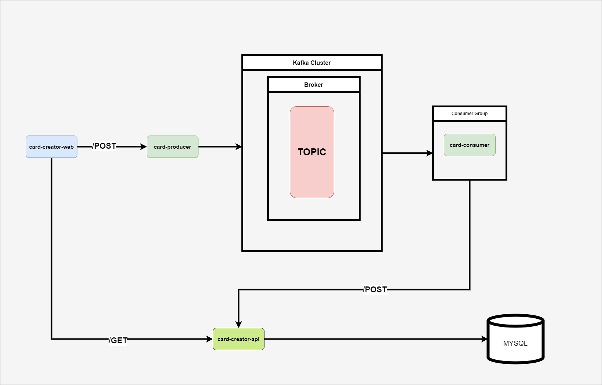

## Credit Card Cretor

  

Credit Card Creator simulates the process of requesting a new credit card from a bank.

  

### Built With

  

* Spring Boot

* React

* Kafka

  

### Application Flow

  
  

## Getting Started

  

### Prerequisites

  

* Kafka Cluster running on 9092

   * [https://kafka.apache.org/quickstart](https://kafka.apache.org/quickstart)

* MySQL DB running on 3037

```

cd docker

docker compose up -d

```

  

### Start the Applications

1. Start **card-creator** Spring Application

2. Start **card-producer** Spring Application

3. Start **card-consumer** Spring Application

4. Start **card-creator-web** React Application

  

### URLs

* Swagger Documentation

   * [http://localhost:9090/swagger-ui/index.html#](http://localhost:9090/swagger-ui/index.html#)

* card-creator-web

   * [http://localhost:5173](http://localhost:5173)

  
  

## Usage

* go to **card-creator-web**

### Create Card

* on create card tab put all the data into the form and submit

   * to provide valid OIB you can use [OIB Generator](https://oib.itcentrala.com/oib-generator/)

* the POST request will be send to **card-producer** which is going to serialize the data and push it to Kafka topic

* once **card-consumer** notices the topic received a new event it will deserialize the data and send it to **card-creator** API

* card creator will store the data in MySQL database with status *PROCESSING*

* once we have a generated credit card we want to wait for two minutes (fixed time that simulates a long running process of checking all the requirements)

  

### Check Status

* input the same OIB

* if the two minutes have passed the status should be displayed as *DONE*